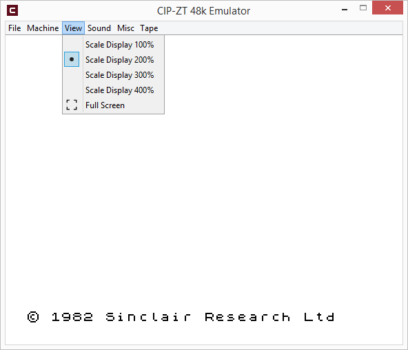
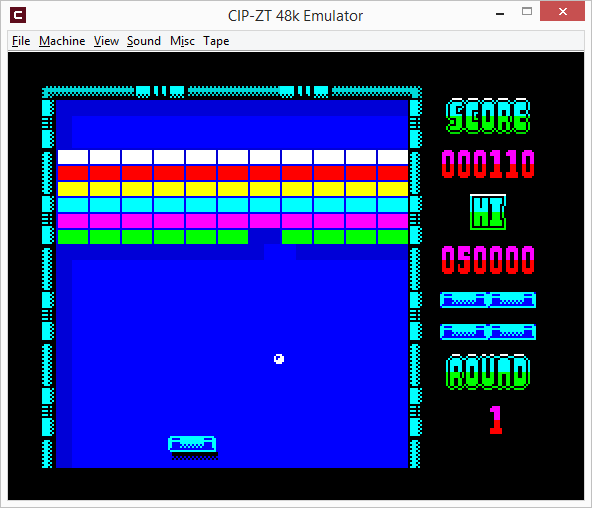
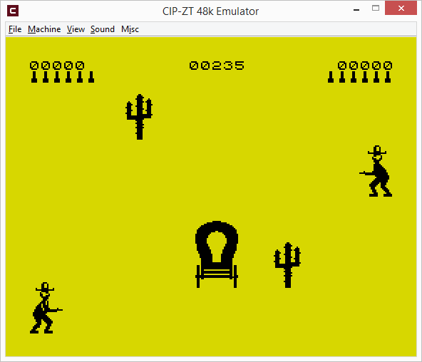
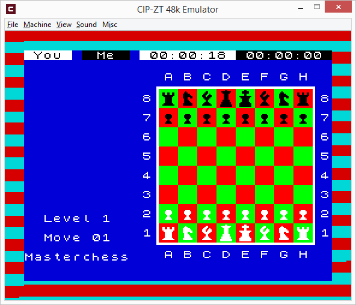

##### CIP-ZT #####
A basic **Z80** CPU and **ZX Spectrum 48K** machine emulator.

## Note ##
The source code presented in this repository is just a sample and has missing parts.

## Warning ##
**DO NOT USE** this application if you have any kind of sensitivity to **flashing images**.  
Depending on how you operate it, this application, just like any other ZX Spectrum 48k machine,  
can generate **flashing images**.

&nbsp;
##### Features #####
- support for the entire **Z80** instruction set, both documented and undocumented
- passes the **zexdoc** test suite
- display scaling
- beeper sound emulation - experimental
- loading and saving of snapshots in **SNA** format
- kempston joystick support - experimental
- kempston mouse support - experimental

&nbsp;
##### Not implemented #####
- support for the **Z80** undocumented flags
- floating bus, which is required by certain games
- memory contention
- tape loading
- 100% accurate timing  
- and more ...

&nbsp;
##### Notes #####
The screen is not drawn the same way as it is done on a real ZX Spectrum machine.  
Intermediary border changes are not handled currently, meaning there are no border stripes,  
only solid-colored borders captured at the end of a frame.

&nbsp;
## Screenshots ##
  
  
  
  

