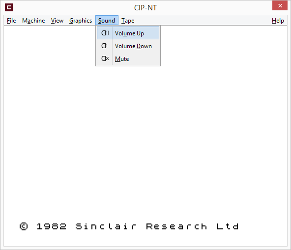

## CIP-NT ##
A **Z80** CPU and **ZX Spectrum** machine emulator.

&nbsp;
## Warning ##
**DO NOT USE** this application if you have any kind of sensitivity to **flashing images**.  
Depending on how you operate it, this application, just like any other ZX Spectrum machine,  
can generate **flashing images**.

&nbsp;
## Features ##
- support for the entire **Z80** instruction set, both documented and undocumented
- passes the **zexdoc** test suite
- display scaling
- machine **16k** or **48k** mode selection
- loading and saving of snapshots in **SNA** format
- quick save snapshot
- export **SCREEN$**
- saving of screenshots in **PNG** format
- support for loading tape image files (**\*.tap**)
- full screen exclusive mode with display mode selection
- border stripes &#x1F60A;
- border width selection: 16px, 24px, 32px, 48px

&nbsp;
## Experimental ##
- beeper sound emulation
- cycle based screen data decoding  
    - just enough to make some games happy - for example *Arkanoid - The Hit Squad*.  
      however, since we do not take memory contention into account, and we do not have a 100% accurate timing,
      this mode can cause undesired artifacts in some other games
- basic kempston mouse support
- kempston joystick support
- pseudo **floating bus** support, subject to timing inaccuracies, just enough to get *Arkanoid* and some other games working

&nbsp;
## Not implemented ##
- support for the Z80 **undocumented flags**
- memory contention, which is required, among other things, for a proper floating bus implementation
- accurate floating bus, which is required by certain games
- 100% accurate timing  
- and maybe more ...

&nbsp;
## ZX Spectrum ROM ##
**Amstrad** have kindly given their permission for the redistribution
of their copyrighted material but retain that copyright.

&nbsp;
## Screenshots ##
  
  
  
  
  
  
  

